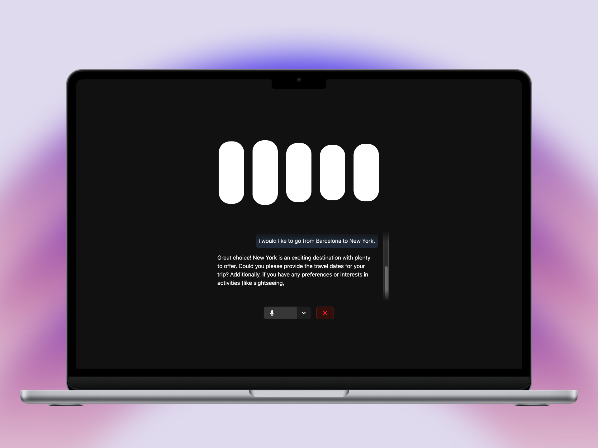
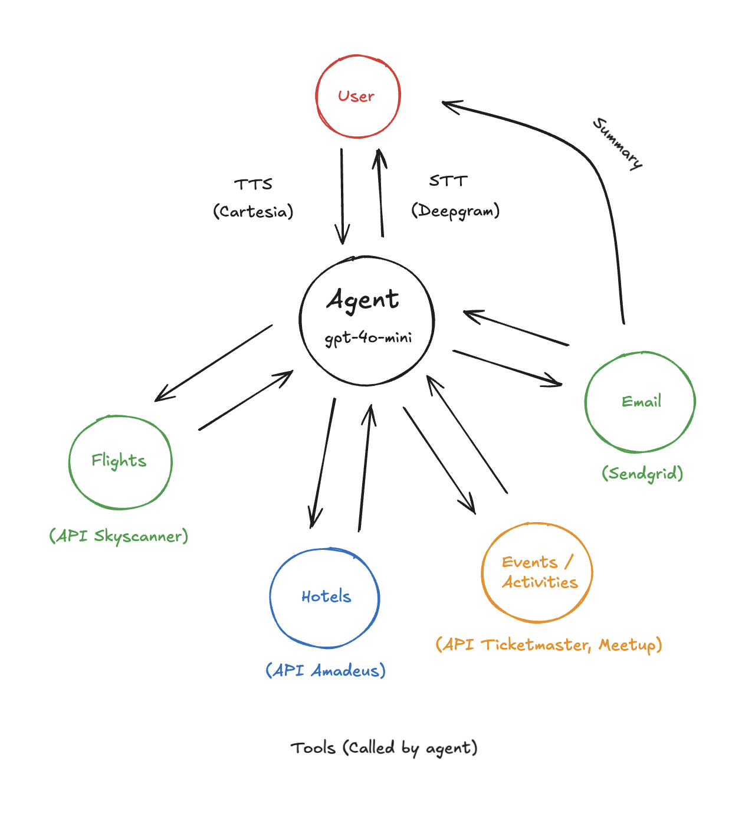

# TripMates - Team Trip Planner AI Agent (1st Place Winner)

TripMates is an AI Agent that you can interact with in real time to help you plan trips with friends. This Agent uses a set of tools that call several APIs — Skyscanner for flight information and prices, Amadeus for hotel data, Ticketmaster and Meetup for activities and events, and more — to provide personalized answers tailored to user preferences, enriched with real-time travel and entertainment data.

## 🧩 The Challenge

Finding the perfect destination for a group of friends living in different locations can be challenging. We've built a smart travel planner that helps groups easily discover ideal destinations based on everyone's preferences, creating a fun, collaborative experience where every member has input in the final decision.

This project was created for the HackUPC 2025 challenge: **"The Perfect Reunion: Finding the Best Destination for Friends Around the World"**, by SkyScanner.

## 🎬 Demo Video

[](https://www.youtube.com/watch?v=xspPeSBnUK8)

## ✨ Features

- **Real-time Voice Interaction**: Talk to our AI trip planner through an interactive interface
- **Collaborative Decision Making**: Input preferences from all group members to find the perfect destination
- **Multi-source Travel Data**: Integrates Skyscanner, Amadeus, Ticketmaster, and more
- **Personalized Recommendations**: Get destination suggestions based on group interests and constraints
- **Live Transcription**: See your conversation with the AI in real-time
- **Email Summaries**: Get a trip summary sent directly to your inbox
- **Real-time Animations**: Engaging interface with responsive visual feedback

## 📷 Screenshots




## 🧠 Agent Architecture

The core of TripMates is an intelligent agent (`gpt-4o-mini`) that acts as the orchestrator for all interactions. Here’s how the architecture works:



### Components:

- **User Interaction**: The user interacts via voice. Speech is transcribed using **Deepgram** (Speach to Text), and the agent responds with natural speech using **Cartesia** (Text to Speach).
- **Agent (gpt-4o-mini)**: Receives user inputs, understands preferences and queries, and decides which tools (APIs) to call to fetch relevant information.
- **Flight Data (Skyscanner API)**: The agent fetches real-time flight options and prices.
- **Hotel Data (Amadeus API)**: Used to retrieve accommodation availability and pricing.
- **Events/Activities (Ticketmaster & Meetup APIs)**: Enables the agent to suggest local events or experiences at the destination.
- **Email Integration (SendGrid)**: Sends a detailed trip summary directly to the user’s email after the planning session.

This modular tool-based design makes the agent both flexible and extensible.

## 🔧 Tech Stack

- **Frontend**: React with LiveKit for real-time communication
- **Backend**: Python with LiveKit Agents
- **AI**: Custom agent built using the LiveKit Agents framework
- **APIs**: 
  - Skyscanner for flight data  
  - Amadeus for hotel information  
  - Ticketmaster & Meetup for events and activities  
  - Deepgram for transcription  
  - Cartesia for text-to-speech  
  - SendGrid for email delivery

## 🚀 Installation & Setup

### Backend Setup

1. Navigate to the backend directory:
   ```
   cd backend
   ```

2. Install dependencies:
   ```
   pip install -r requirements.txt
   ```

3. Create `.env` file from the example:
   ```
   cp .env.example .env
   ```

4. Fill in the API keys in the `.env` file:
   ```
   LIVEKIT_API_KEY=<your_api_key>
   LIVEKIT_API_SECRET=<your_api_secret>
   LIVEKIT_URL=wss://<project-subdomain>.livekit.cloud
   DEEPGRAM_API_KEY=<your_deepgram_key>
   OPENAI_API_KEY=<your_openai_key>
   CARTESIA_API_KEY=<your_cartesia_key>
   SKYSCANNER_API_KEY=<your_skyscanner_key>
   SENDGRID_API_KEY=<your_sendgrid_key>
   ```

5. Run the server:
   ```
   python main.py dev
   ```

### Frontend Setup

1. Navigate to the frontend directory:
   ```
   cd frontend
   ```

2. Install dependencies:
   ```
   npm install
   ```

3. Create `.env` file from the example:
   ```
   cp .env.example .env
   ```

4. Fill in the API keys in the `.env` file:
   ```
   LIVEKIT_API_KEY=<your_api_key>
   LIVEKIT_API_SECRET=<your_api_secret>
   LIVEKIT_URL=wss://<project-subdomain>.livekit.cloud
   ```

5. Run the development server:
   ```
   npm run dev
   ```

## 🏗️ Architecture

The application consists of two main components:

1. **Python Backend**: 
   - Handles the AI agent logic with LiveKit Agents
   - Integrates with Skyscanner API for flight data
   - Processes user preferences and generates travel recommendations

2. **React Frontend**:
   - Provides an interactive voice interface
   - Displays real-time transcriptions and AI responses
   - Shows flight options and destination recommendations
   - Connects to backend via WebSockets for real-time communication
